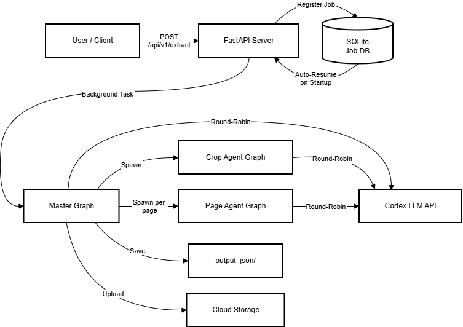
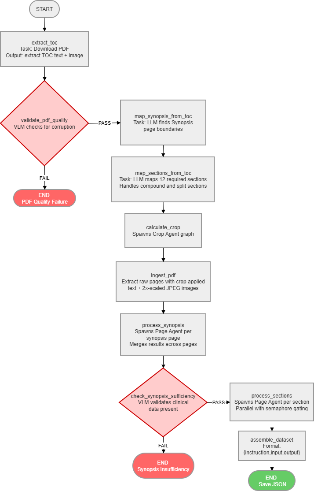
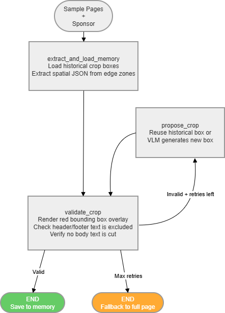

# Lilly PDF Extractor Agent

An asynchronous, multi-agent PDF extraction pipeline built with **LangGraph** and **Cortex LLMs**, exposed via **FastAPI**. Designed to extract clinical trial protocol data from PDF documents and produce structured JSON training datasets with high-fidelity markdown output.

---

## Key Features

- **Multi-Agent LangGraph Orchestration** — 3-tier graph hierarchy (Master → Crop → Page) with 10+ specialized LLM agents
- **Fully Asynchronous** — `httpx.AsyncClient` + `asyncio` for non-blocking I/O across all agent nodes
- **Resilient Job Persistence** — SQLite-backed job tracking with auto-resume on server restart via LangGraph checkpointing
- **Adaptive Retry Logic** — Self-correcting page extraction loop that diagnoses error type (layout vs. rule) and routes to the appropriate retry node
- **Circuit Breakers** — PDF quality and synopsis sufficiency gates that halt processing early on unsuitable documents
- **Dynamic Crop Memory** — Learns and remembers optimal bounding box coordinates per clinical sponsor
- **Sponsor-Aware Prompts** — Loads sponsor-specific extraction prompts at runtime with fallback to general templates
- **Multi-Cloud Storage** — Unified `CloudStorageManager` supporting AWS S3, Google Cloud Storage, and local fallback
- **Structured Output Enforcement** — Pydantic schema injection into LLM prompts for guaranteed JSON compliance
- **Round-Robin Load Balancing** — Thread-safe distribution of LLM calls across multiple Cortex agent copies

---

## Architecture Overview

### High-Level System Flow



### Master Graph — Orchestrator (10 Nodes)

The master graph manages the end-to-end extraction pipeline. It processes the PDF through sequential phases with two circuit breaker gates that can halt processing early.



### Page Agent — Per-Page Extraction (4 Nodes + Retry Loop)

Each page goes through a VLM extraction → LLM reconciliation → VLM validation cycle. On failure, the error type determines whether to retry extraction (layout issues) or reconciliation (rule-following issues). After exhausting retries, a best-of-N judge selects the best attempt.



### Crop Agent — Bounding Box Calculation (3 Nodes + Retry Loop)

The crop agent determines the optimal bounding box to exclude headers/footers from PDF pages. It leverages sponsor-specific memory to avoid recalculating known-good crop boxes.


---

## Project Structure

```
lilly-pdf-extractor-agent/
├── app.py                          # FastAPI server, endpoints, background task manager, auto-resume
├── main.py                         # CLI entry point for standalone testing
├── batch_submit.py                 # Interactive batch PDF submission script
├── requirements.txt                # Python dependencies (installed inside Docker)
├── requirements_local.txt          # Lightweight deps for local pre-build steps (requests, python-dotenv)
├── json2md.py                      # Utility: convert output JSON to markdown
├── Dockerfile                      # Container image build (Python 3.12.4, full image)
├── .dockerignore                   # Excludes test dirs, runtime output, etc.
├── .env.example                    # Template for required environment variables
├── pip.conf                        # Internal Artifactory registry for langchain-cortex
│
├── agents/
│   ├── master_graph.py             # LangGraph orchestrator (10 nodes)
│   ├── page_agent.py               # Per-page extraction graph (4 nodes + retry)
│   ├── crop_agent.py               # Bounding box calculation graph (3 nodes + retry)
│   ├── cortex_langchain.py         # LangChain-based Cortex LLM wrapper (active, OAuth2 + AWS auth)
│   ├── cortex_llm_config.py        # Legacy Cortex API wrapper (kept for reference)
│   └── agent_registry.py           # [AUTO-GENERATED per-user — do not commit]
│                                   #   Maps agent roles → Cortex model copies (load balancing)
│
├── core/
│   ├── config.py                   # Environment variables and tuning knobs
│   ├── state.py                    # TypedDict state schemas + Pydantic validation models
│   ├── initial_state.py            # Factory: creates base state dict for pipeline
│   ├── job_manager.py              # SQLite job persistence (PENDING → IN_PROGRESS → COMPLETED | FAILED | ABORTED)
│   └── logger.py                   # Dual-output logger (console + file)
│
├── prompts/
│   ├── synopsis_sys_inst.txt       # System prompt for synopsis extraction
│   └── sponsors/
│       ├── section/                # Sponsor-specific section extraction prompts
│       │   ├── general.txt
│       │   └── pfizer.txt
│       └── synopsis/               # Sponsor-specific synopsis extraction prompts
│           ├── general.txt
│           └── Boehringer Ingelheim.txt
│
├── utils/
│   ├── pdf_parser.py               # PDF download, TOC extraction, page merging, crop utilities
│   ├── cloud_storage.py            # Unified AWS S3 / GCP / local storage manager
│   └── title_card.py               # ASCII art banner display
│
├── manage_cortex_agent/            # Local dev only — NOT included in Docker image
│   ├── manage_agents.py            # Script to provision/manage Cortex agent copies
│   ├── agents_config.json          # Agent deployment configuration
│   └── README.md                   # Agent management documentation
│
├── memory/                         # Runtime data (gitignored, Docker volume at /app/memory)
│   ├── sponsor_based_crop_memory.json  # Learned crop boxes per sponsor
│   ├── job_states.db               # SQLite job tracking database
│   ├── master_graph_checkpoints.db # LangGraph checkpoint database
│   └── pdf_cache/                  # Downloaded PDF cache
│
└── tests/
    ├── conftest.py                 # Pytest fixtures
    ├── test_concurrency.py         # Concurrency safety tests
    ├── test_graceful_degradation.py # Resilience tests
    ├── test_load_api.py            # API load tests
    └── locustfile.py               # Locust load testing config
```

---

## Getting Started

Docker is the recommended way for team members to run the pipeline. It bundles all dependencies, avoids version conflicts, and provides a reproducible environment.

### Prerequisites

- **Docker Desktop** installed and running
- A populated `.env` file (copy from `.env.example`)
- `gcp-service-account-key.json` in the project root (for GCP uploads — optional)
- `agents/agent_registry.py` generated (see Step 1 below)

### Step 1: Deploy Cortex Agents & Generate Registry

Before building the Docker image, deploy your Cortex agent copies and generate the registry file. This must be run from a local Python environment with network access to `cortex.lilly.com`:

```bash
# Create and activate a virtual environment (one-time)
python -m venv .venv

# Windows
.venv\Scripts\activate

# Linux/macOS
source .venv/bin/activate

# Install only the lightweight local dependencies (NOT the full requirements.txt)
pip install -r requirements_local.txt

# Deploy agents to Cortex
python manage_cortex_agent/manage_agents.py deploy

# Generate agents/agent_registry.py (must run BEFORE building the Docker image)
python manage_cortex_agent/manage_agents.py registry
```

- **`deploy`** — creates your personal Cortex agent copies on `cortex.lilly.com`.
- **`registry`** — generates `agents/agent_registry.py`, a local Python file that maps agent roles to your deployed copies. This file is gitignored because each team member gets their own set of agents.

> **Note:** Each team member uses their own `OWNER_EMAIL`. This prefixes all deployed agent names with your identity (e.g. `deepaktm-pageagent-extractor`), keeping each person's agents isolated.

### Step 2: Configure Environment

Copy `.env.example` to `.env` and fill in your credentials:

```bash
cp .env.example .env
```

See the `.env.example` file for all available variables and their descriptions.

<details>
<summary><b>Environment Variables Reference (click to expand)</b></summary>

| Variable | Required | Default | Description |
|:---|:---:|:---:|:---|
| `OWNER_EMAIL` | Yes | — | Your Lilly email — used to prefix agent names and set ownership |
| `CORTEX_COOKIE` | Yes | — | Authentication cookie for the Cortex agent management API |
| `CORTEX_CLIENT_ID` | Yes | — | Azure AD application client ID |
| `CORTEX_CLIENT_SECRET` | Yes | — | Azure AD client secret |
| `CORTEX_AUTHORITY` | Yes | — | Azure AD authority URL |
| `CORTEX_SCOPE` | Yes | — | Cortex API scope for token acquisition |
| `CORTEX_BASE_URL` | No | `https://gateway.apim...` | Cortex APIM gateway base URL |
| `AWS_S3_BUCKET_NAME` | No | — | AWS S3 bucket for result uploads |
| `GCP_BUCKET_NAME` | No | — | GCP bucket for result uploads |
| `MAX_CONCURRENT_PDFS` | No | `1` | Max PDFs processed simultaneously |
| `MAX_CONCURRENT_SECTIONS` | No | `5` | Max sections processed in parallel per PDF |
| `LLM_TIMEOUT_SECONDS` | No | `180` | Timeout for text-only LLM calls (seconds) |
| `LLM_TIMEOUT_MULTIMODAL_SECONDS` | No | `240` | Timeout for multimodal LLM calls (seconds) |
| `LLM_RETRY_ATTEMPTS` | No | `4` | Max retry attempts for LLM API calls |
| `PAGE_RETRY_ATTEMPTS` | No | `2` | Outer retry attempts per page agent invocation |
| `PAGE_RETRY_BACKOFF_SECONDS` | No | `60` | Backoff delay between page retries |
| `PAGE_THROTTLE_SECONDS` | No | `3` | Delay between sequential page processing |
| `DEBUG` | No | `false` | Enable debug mode (crop visualization, verbose logs) |

</details>

### Step 3: Build the Docker Image

```bash
docker build -t lilly-pdf-extractor .
```

The image uses `python:3.12.4` (full, not slim) to avoid corporate network issues with `deb.debian.org`. `pip.conf` is baked in so that the internal Artifactory registry is available during the build.

### Step 4: Run the Container

```bash
docker run -p 8000:8000 \
  -v lilly-memory:/app/memory \
  -v lilly-output:/app/output_json \
  -v lilly-logs:/app/logs \
  --name lilly-extractor \
  lilly-pdf-extractor
```

The three `-v` flags mount **named Docker volumes** so that SQLite databases, output JSON files, and logs persist across container restarts.

The API is now available at `http://localhost:8000` (Swagger docs at `/docs`).

On startup, the server automatically checks for interrupted jobs (PENDING, IN_PROGRESS, or FAILED) and resumes them. ABORTED jobs are not retried.

### Step 5: Submit an Extraction Request

Submit a PDF via curl, the Swagger UI at `/docs`, or the interactive batch script:

```bash
# Single PDF via curl
curl -X POST http://localhost:8000/api/v1/extract \
  -H "Content-Type: application/json" \
  -d '{"pdf_url": "https://example.com/clinical-protocol.pdf", "sponsor_name": "Eli Lilly"}'

# Interactive batch submission (prompts for sponsor + PDF URLs)
python batch_submit.py
```

Then check the status:

```bash
curl http://localhost:8000/api/v1/status/<job_id>
```

And retrieve results when complete:

```bash
curl http://localhost:8000/api/v1/results/<job_id>
```

### Container Management

```bash
# Stop the container
docker stop lilly-extractor

# Restart an existing container
docker start lilly-extractor

# Remove the container (volumes are preserved)
docker rm lilly-extractor

# Rebuild after code changes
docker build -t lilly-pdf-extractor .
docker run -p 8000:8000 \
  -v lilly-memory:/app/memory \
  -v lilly-output:/app/output_json \
  -v lilly-logs:/app/logs \
  --name lilly-extractor \
  lilly-pdf-extractor
```

### Local Development (without Docker)

For development / debugging, you can run the server directly:

```bash
# Activate the virtual environment created in Step 1
# Windows
.venv\Scripts\activate

# Linux/macOS
source .venv/bin/activate

# Start the server
uvicorn app:app --host 0.0.0.0 --port 8000
```

> **Note:** When done, clean up your Cortex agents with `python manage_cortex_agent/manage_agents.py delete`.

---

## API Reference

### Submit Single Extraction

```
POST /api/v1/extract
```

**Request Body:**

```json
{
  "pdf_url": "https://example.com/path/to/clinical-protocol.pdf",
  "sponsor_name": "Eli Lilly"
}
```

**Response** `202 Accepted`:

```json
{
  "job_id": "a1b2c3d4-e5f6-7890-abcd-ef1234567890",
  "message": "Extraction job successfully queued.",
  "status_url": "/api/v1/status/a1b2c3d4-e5f6-7890-abcd-ef1234567890"
}
```

---

### Submit Batch Extraction

```
POST /api/v1/extract/batch
```

**Request Body:**

```json
{
  "requests": [
    { "pdf_url": "https://example.com/protocol-1.pdf", "sponsor_name": "Pfizer" },
    { "pdf_url": "https://example.com/protocol-2.pdf", "sponsor_name": "Boehringer Ingelheim" }
  ]
}
```

**Response** `202 Accepted`:

```json
{
  "batch_id": "b1c2d3e4-f5a6-7890-bcde-fa1234567890",
  "jobs": [
    {
      "job_id": "...",
      "message": "Extraction job successfully queued.",
      "status_url": "/api/v1/status/..."
    },
    {
      "job_id": "...",
      "message": "Extraction job successfully queued.",
      "status_url": "/api/v1/status/..."
    }
  ]
}
```

---

### Check Job Status

```
GET /api/v1/status/{job_id}
```

**Response** `200 OK`:

```json
{
  "job_id": "a1b2c3d4-e5f6-7890-abcd-ef1234567890",
  "status": "COMPLETED",
  "error_message": null,
  "result_url": "/api/v1/results/a1b2c3d4-e5f6-7890-abcd-ef1234567890"
}
```

Possible `status` values:

| Status | Meaning |
|:---|:---|
| `PENDING` | Job queued, waiting for a pipeline slot |
| `IN_PROGRESS` | Pipeline is actively processing |
| `COMPLETED` | Extraction finished successfully — results available |
| `FAILED` | System error (LLM timeout, network issue, etc.) — retried on restart |
| `ABORTED` | PDF rejected by quality checks (scanned, unreadable, etc.) — **not** retried |

---

### Retrieve Results

```
GET /api/v1/results/{job_id}
```

**Response** `200 OK`: Returns the final JSON dataset (see [Output Format](#output-format) below).

---

### View Live Logs

```
GET /api/v1/logs?lines=200
```

Returns the last N lines of the extraction log as plain text. Default: 200 lines.

---

### Health Check

```
GET /health
```

**Response** `200 OK`:

```json
{
  "status": "ok",
  "timestamp": "2026-03-23T12:00:00+00:00"
}
```

---

## Monitoring Logs

**Docker container logs (recommended):**

```bash
docker logs -f lilly-extractor
```

**Browser (API endpoint):**

Visit `http://localhost:8000/api/v1/logs?lines=200` to view the last N lines of the extraction log.

**Local development (host filesystem):**

Windows (PowerShell):

```powershell
Get-Content -Path logs\pipeline_*.log -Wait -Tail 50
```

Linux / macOS:

```bash
tail -f logs/pipeline_*.log
```

---

## Output Format

The pipeline produces a JSON object where each key is a normalized section title, and the value contains an `instruction` / `input` / `output` triplet for training data:

```json
{
  "study design": {
    "instruction": "You are an expert Clinical Medical Writer. Below is the Synopsis for a clinical trial. Based strictly on this information, generate the content for the section: Study Design.",
    "input": "Protocol Number: ABC-1234\nStudy Title: A Phase 3 Randomized...\n...",
    "output": "# Study Design\n\nThis is a Phase 3, randomized, double-blind..."
  },
  "study population": {
    "instruction": "You are an expert Clinical Medical Writer. Below is the Synopsis for a clinical trial. Based strictly on this information, generate the content for the section: Study Population.",
    "input": "Protocol Number: ABC-1234\nStudy Title: A Phase 3 Randomized...\n...",
    "output": "# Study Population\n\nApproximately 500 adult patients aged 18-75..."
  }
}
```

**12 Required Sections**: study design, study population, objectives, endpoints, treatment, procedures, statistical analysis, efficacy, safety, pharmacokinetics, biomarkers, data monitoring

---

## Data Persistence

| Store | Location | Purpose |
|:---|:---|:---|
| Job Tracking | `memory/job_states.db` | SQLite database for job status persistence across restarts |
| Graph Checkpoints | `memory/master_graph_checkpoints.db` | LangGraph mid-pipeline checkpoints for resumption |
| Crop Memory | `memory/sponsor_based_crop_memory.json` | Learned bounding box coordinates per sponsor (max 3 per sponsor) |
| PDF Cache | `memory/pdf_cache/` | Downloaded PDFs cached by job ID |
| Final Output | `output_json/` | Generated JSON datasets by NCT number + timestamp |

> **Docker volumes:** When running in Docker, mount `memory/`, `output_json/`, and `logs/` as named volumes (see [Step 4](#step-4-run-the-container)) so that all data survives container restarts. Without volumes, data is lost when the container is removed.
